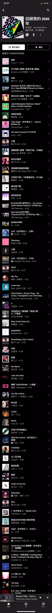

2020对很多人来说是一定无法忘记的一年，对我更是如此

## 考研

可能今年做过最大的决定就是9月份决定不考研想直接去工作了，其实家里估计暑假就看出来了，在9月开学去火车站的路上就挺想说的终究还是不敢。他们每天说那些鸡汤我是真的一点都听不进去，也侧面反映了我们家很少能面对面好好的交流未来或者是复盘，总是依靠文字，但能保证看得进去吗？今天又重新翻了猪窝的聊天记录，字里行间看到的还是他们的无奈。

同学都觉得我‘放弃’可惜，每次我都说我这是止损。好好想了下，一个是我暑假偷懒了，天天晚上打球，白天想着晚上怎么打，落后了很多进度。最重要的是我怕了，感觉没有技术，基础也薄弱，没考上能干嘛呢，回家吗？那个连打球都不会进步的地方早已放弃了。计算机确实卷，但是我觉得都没什么好怕的，就像每次跟宁海生活的朋友说我规划的未来一样，永远都是劝退我，要么就是说我看不起宁海。我对别人的看法已经无所谓了，反正说这些话能让他们开心的话那也算积德了。

## 生活

整个大三过的很快，经历了最长的寒假，所以说今年在家里的时间也很长，很多想做的事情，一件也没有做成。比如学习框架、和爸爸学做菜，练球，练核心……最好的时间段都被我拿来在床上和球场上。就每年好像都是这种死循环，所有我才没有成功过吧。就跟玩游戏一样，我也是玩不好的那种，打球更不用说了，十几年了都是这样没有任何球路。

下半年回到学校后，我被老学院的辅导员直接强行赶出老寝室换到楼上的现学院的寝室。上学期我们还商量的很好说是需要我搬会提前通知我，这样来看他跟土匪有什么区别呢？只知道完成任务然后舔上级。整个四年学校给我最好的印象可能就是让我住到了刚造好的王子楼了吧，其他是真的毫无人性可言，教育看起来也是早已崩塌的那种。

今年下半年很幸运，车辆的一个同学给我申请到了实验室的一个座位，接下来3个月我就是寝室食堂实验室球场，也在结课的那个礼拜顺利的找到了实习。能找到一个喜欢交流技术同样喜欢打球的人是真的三生有幸，感谢这个同学带我入坑计算机。

## 工作

面试的那天我就感觉非常糟糕，地铁上我还非常自信，甚至想好了一大串话来吹嘘我的个人项目和憧憬。到了之后就是一连串的基础问题被问倒了，框架等技术几乎没问，回去之后我也反思了很多。能做出东西、只是会用还是太浅了，基础才是基石。

2020也就350左右的提交量而且大部分都是划水提交，真想好好做个开源项目的时候是在下半年，可惜后来就去实习了，发现自己及其菜，希望21年能好好开发一个好的开源项目。

每周的写写代码时间也变长了，实习前其实一直就是在CRUD。这两个月跟我的mentor也学到了非常多，总体感觉就是跟不上他的思想，永远在他后面用最烂的解决办法解决问题。

21年春招希望可以认真把握一下。

## 💻🏸

### 影视

年初看完了《纸钞屋》最新季，真不喜欢这种拉屎拉到一般截断的感觉

年度最佳番剧《进击的巨人》

暑假诺兰月看了3部烧脑片，二刷《盗梦空间》、《星际穿越》，《信条》只看了一遍，没看懂。

8月看了《八佰》，10月《夺冠》（有种前几年看李宗伟的感觉）、跨年夜《送你一所小红花》

### 游戏

20年游戏玩的不多，台式机一直放在学校吃灰……不过回学校就玩了几天就不想玩了

1. 只狼3周目
2. 彩虹六号终于上白金一次
3. 2077（2小时hhh）
4. 胡闹厨房2（就是吵架厨房）

### 音乐

Youtube music真的香，自从看了1million，听歌就是看着手机听了

年度歌单

### 摄影

卖了相机和无人机之后就没有拍视频拍照片的欲望了，可能我也不是这块料吧，当时还是冲动了，像是买了个玩具，买来就吃灰。以后有机会的话希望能报班学习一下。暂时也拿不出闲钱和时间搞这些了。

### 羽球

20年应该算是打的最多的一年了，也是大运会后最燃的一年。最好的练球时光已经过去了，再也没有了，不过也没什么好后悔的了，希望以后打球能带点脑子，学习一下父亲的打法。

## 🐏

最后是感谢来到城西之后新认识的朋友们啦，大家人都很好，竟然又遇到了老乡。感觉从小到大没有一段社交是我从零开始经营的，可能这也是一种幸运吧，承蒙大家照顾了。

感谢陪我玩游戏的室友

感谢陪我打球的朋友们

感谢父母理解和尊重我的决定。

**2021，希望能变得自律，向着目标前进！**
