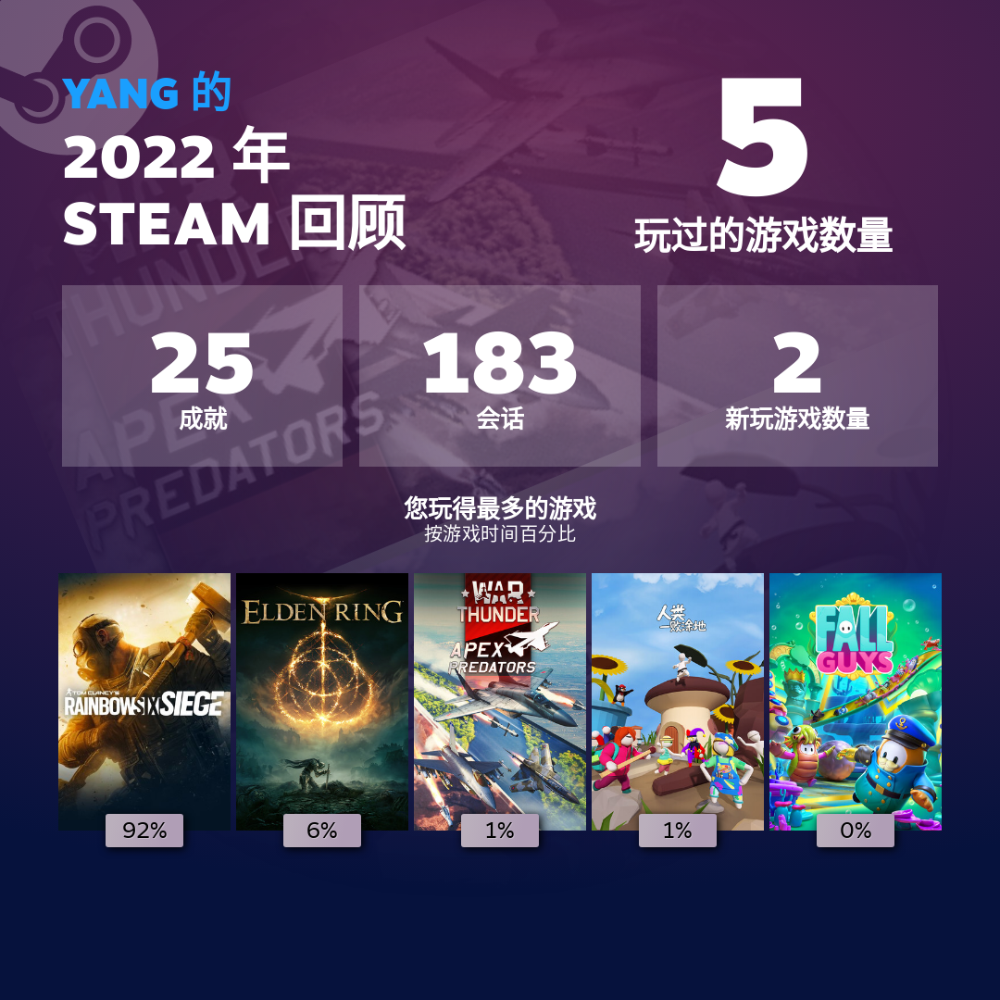
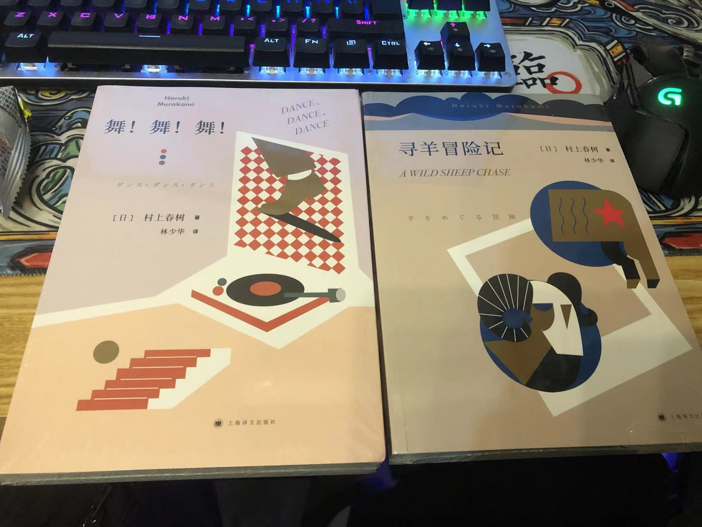
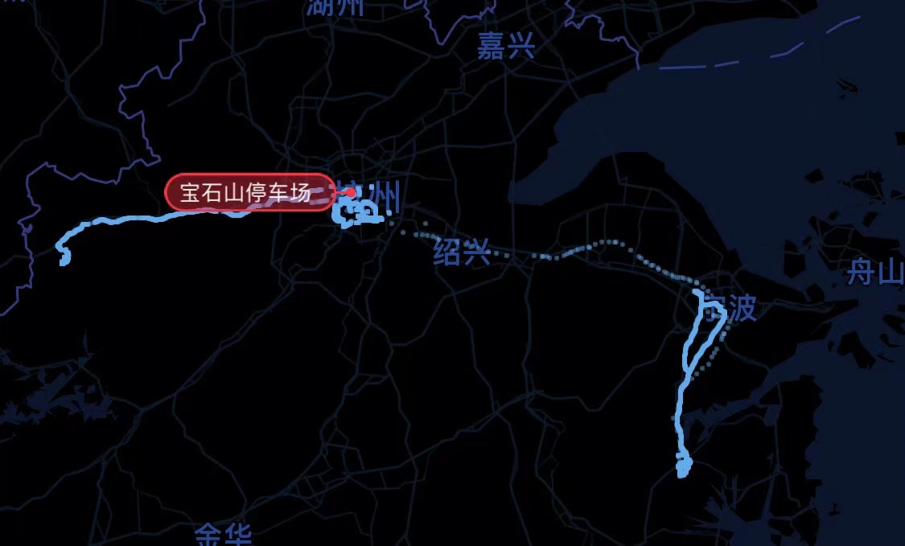
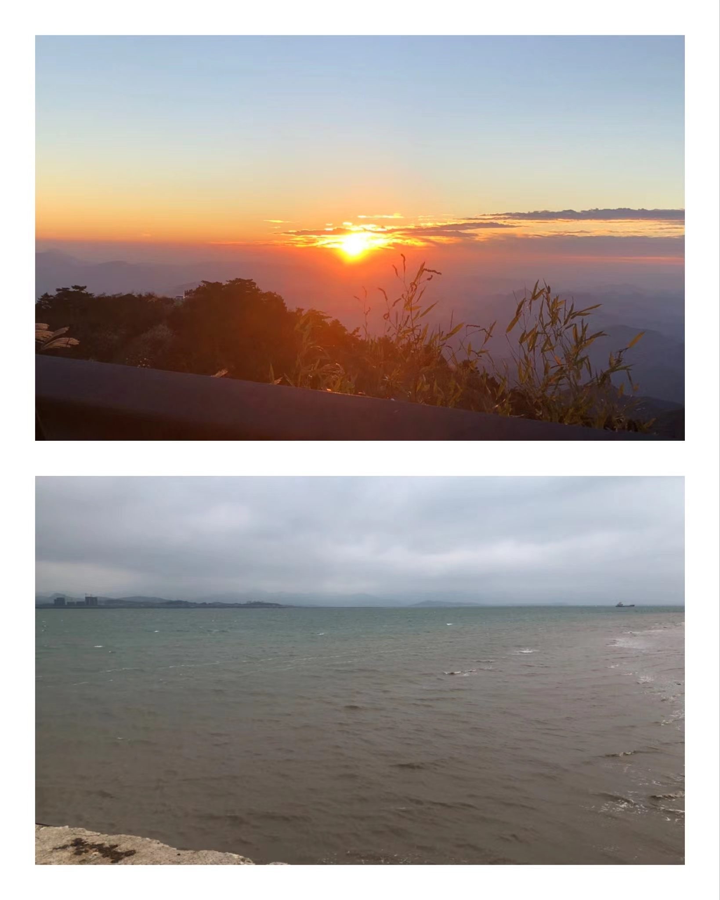

> 今年是魔幻的一年，偷懒的一年

其实这个总结也有点写不动了，不知道写点什么。今年过的太差，对自己没有了信仰

[2022](https://github.com/ISheepp/2022) 今年的库在 6 月份之后就停摆了，我也不知道为什么就是记不动了。

---

1月 被隔离，无力、恐惧、愤怒在那几天得到了淋漓尽致的表现。

2月 俄乌战争，21世纪，难以置信一个国家向另一个主权国家发动战争。 | 铁链女

3月 fomo 在**华[run](https://mirror.xyz/0x4c59A4002ea761A295B8c026e5b67f52e93AaA1E/nUPgjAVp6ixgYuQlgq0GdVB_2Knv59OXbQOyX6-4Sec)万家**的言论中 （我真的很容易被人影响啊）| 东航坠机

4月 上海[《四月之声》](https://www.youtube.com/watch?v=38_thLXNHY8&ab_channel=KevininShanghai) | “这是我们最后一代” | 河南银行暴雷

5月 [$Luna归零](https://www.theblockbeats.info/news/30533)。第一次滚仓开空单，顺便了解前几年中国的P2P事件。

6月 见习期答辩 结果不错，不过我知道只是恰巧一小部分正中评委心意。| 唐山打人

7月 美国公布 6 月CPI年率 9.1% ，加息牛，明年降息熊？

8月-9月 DXY 114 新高，USDCNH破7，一度要重回我小时候的汇率 | 贵州死神大巴

10月 桥 | 连任， 没有 没有 没有 通过

11月 白纸 | 富士康大逃亡

12月 国内放开，感染Covid。

## Covid

+ 只能说相对于某些城市，我这里挨过的铁拳算是比较少的，对防疫的看法已经写过[一篇](https://isheep.xlog.app/covid--in-my-eye)，极度讨厌防疫爱好者

+ 发现部分人喜欢对远方的苦难拍手叫好，对身边的苦难沉默不语，对自己的苦难歇斯底里。祸不及己身的时候就会幸灾乐祸，爱国家远超爱家人 -> 有国才有家，有你才生你的妈。当铁拳将至之时就只会喊“这个世界没有好人了”

+ 由于被隔离怕了，导致有段时间不太敢回家
+ 年底的锐角转弯1个月走完了别人2年的路
+ [感染](https://isheep.xlog.app/infect-covid)其实不是什么大事，没药才是最离谱的。就像封城一样，没有食物才是人祸。
+ 想太多了，脑中浮现过解体、 sir this way。实际上很多问题是 nation 的问题，就像如果我们公投的话，那灾难真的会降临。

## Code

工作上并没有非常新颖的突破，只是在不断地提高沟通技巧和 battle 能力。还是经常会环绕在 _我只是一颗生锈的螺丝钉，愿来生没有红黑树_ 的 PTSD 中。

玩了很多新的东西，React.js、Nest.js、Solidity、GraphQL……，算是增加了一些广度吧，对技术确实有了一些新的见解。

意识到对于产品理解的重要性，不能过于关注技术本身。

但是今年代码写的实在是太少了，去年给自己挖的坑也一个都没填🤔。

## Invest

一次次见证了
**狂欢是崩塌的边缘适合抽身离场
寒冬是温柔的良夜适合纵情向前**

又不是没有归零过，重头再来罢了。

## xLog

+ 老的域名没来得及做重定向就被回收了，那就算了吧，正好备案也一起注销掉，就是可惜了我的图床了。以后不会在国内做任何ICP备案。
+ 正式迁移到[xLog](https://xlog.app/)，xLog完全[开源](https://github.com/Crossbell-Box/xlog)，运行在[Crossbell](https://crossbell.io/)上，以 IPFS 作为存储。匿名冲浪，虽然匿名不等于隐私，但不怕有一天啥都没了。

## 🎮影视&游戏

看了：

+ [《法证先锋Ⅴ》](https://movie.douban.com/subject/35390918/)
+ [《边缘世界》](https://movie.douban.com/subject/30198955/)
+ [《毒液2》](https://movie.douban.com/subject/30382416/)
+ [《莉可丽丝》](https://movie.douban.com/subject/35722670/)
+ [《Top Gun: Maverick》](https://movie.douban.com/subject/6893932//)
+ [《The Big Short》](https://movie.douban.com/subject/26303622/)
+ [《奇异博士2》](https://movie.douban.com/subject/30304994/)

今年花在游戏上的时间可不少，5月拉了个小群后就一直在打 R6，也只有和群友一起玩才能短暂治好我的电子ed。

玩了：

+ Rainbow Six
+ Left 4 Dead 2
+ Human Fall Flat
+ Fall Guys
+ Elden Ring

小时候喜欢一个人玩单机游戏，现在却很难一个人静下来玩单机游戏，记得老头环没玩多久就被劝退了。

## 📕书籍

啥也没看完，甚至还在不停的买，本本吃灰。目前在翻《寻羊历险记》和《舞舞舞》

## 🏸羽球

果然跟我想一样，在毕业之后呈反比例函数趋势下滑。两方面原因吧，一个是打的少了，特别是工作日几乎不打了，根本没力气。其次好像兴趣没以前那么大了。

今年由于人道主义不可抗力，导致比赛集中在下半年而且举办得磕磕盼盼。

报名的比赛：

1. **集团比赛**  躺了第一
2. **滨江区企业联赛**   直接降级 希望明年让我替补 我太菜了
3. **家里举办的小比赛**  看牙顺便打 一轮游 纯见朋友
4. **李宁3v3团体** 8强 全靠对手弃权
5. **双雄会** 跟3v3冲突 没打 买衣服
6. **王者之志** 队友封控出不来 没打 衣服也被吞了
7. **平民英雄** 16强 进8确实打不过
8. **平民英雄（另一站）** 16强 进8碰到大学学长寄了

每次比赛还是手紧，然后打不开，咋就改不掉呢。

## 👟足迹

今年10月开始使用[一生足迹](https://apps.apple.com/cn/app/%E4%B8%80%E7%94%9F%E8%B6%B3%E8%BF%B9-%E8%AE%B0%E5%BD%95%E4%BA%BA%E7%94%9F%E8%BD%A8%E8%BF%B9/id1225520399)app，虽然我真的很宅，不过这个app让我有点动力点亮更多的地方。像北岛说的那样，生活的悲欢离合远在地平线之外，而眺望是一种青春的姿态，应该多出去走走的。

> 我的爱源于好奇。要控制自己不要对人的好奇超过对事物的好奇，尽情地去探索这个世界吧，这个宇宙星空，这个沙滩海浪，还有很多很多美妙的事物值得。 --[From](https://twitter.com/Philo2022/status/1606600812847067137)

## 🎈展望&目标

不会给明年立目标了，反正也不会做。

希望能多做点，少想点。

---
很不幸在毕业时赶上新冠，在工作后遇上QT。幸运的是在尚年轻的时候有机会能更进一步认识这个世界的运作。人生一大幸运是能够不断刷新认知，从无知到有知，到有知再到无知。
