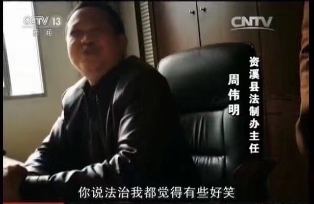
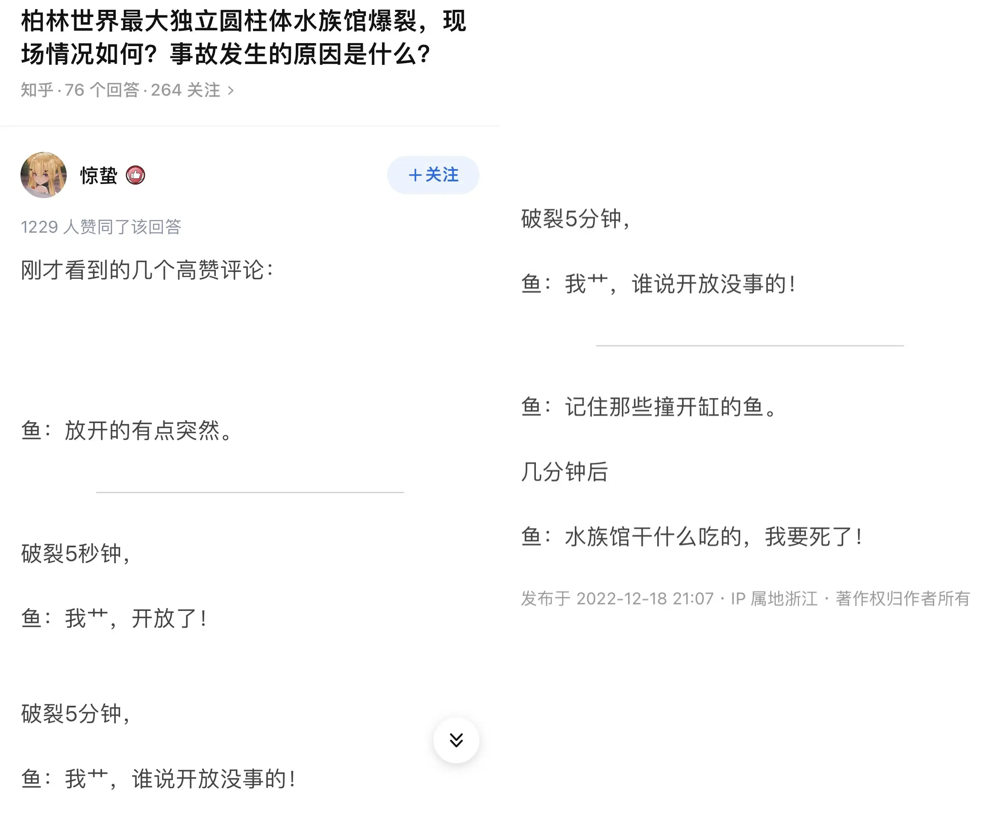

>We shall meet in the place where there is no darkness    ---《1984》

三年过去了，事实变得不再重要，人们相信什么最重要，它就会是事实，媒体的宣传能力远远驾凌于科学、常识之上。甚至举白纸这种苏联笑话竟然发生在了身边……

## 封控、人权
今年年初我被集中隔离过，虽然只有短短3天4晚，但足足让我体会到失去自由的感觉，而且没有空调、阳台是封死的，晚上有探照灯时不时照在窗帘上（算是铁窗泪？）。以至于我在要出去的前一天晚接到上社区我打电话通知第二天可以回家的时候我出现了非常典型的斯德哥尔摩效应。

那么不停封控的原因是什么呢？动态清零吗，只是个数字而已，我觉得一切都是由类似公司的KPI制度所造成，说白了就是利益的问题。

这一次的权力下放使得中国最透明的一群人---居委会终于抬起了头，过去几十年，这个**种群**给大家的感觉就是可有可无，甚至有时候很烦（各种上门什么的）。但现在不一样了，他们权力大了，他们有话语权了，他们能一锤定音控制一个人的自由，用各种理由打到你服为止，他们肯定一下子感受到了中国人民站起来了的感觉，以至于有些人产生了前所未有的快感，从而导致全国各地出现各种人祸。人民的权力被不停的侵犯，底线不停的往后退。

然而这一切都是由体制造成。众所周知，中国是没有媒体的。中国的媒体没有采编权，全由宣传部监管，所有的一切都是政府想让大家看到的。权力下放后，基层人员为了完成KPI（也就是清零），可以不择手段，而上层也是不关心过程，只关注考核结果。权力是对权力的来源负责的，不是为了人民或者正确的事情负责的。上层制定了动态清零的核心KPI，却没有给出方向，使得各个地方政府有层出不穷的玩法来完成指标。再由媒体配合打一波信息差，就能很好的安抚当地人接受非人的手段。

## 疫苗、核酸
12月3、4、5日，全国多个地方宣布不再查验核酸，不再封控。12月7日，[新十条](https://k.sina.com.cn/article_5044281310_12ca99fde02001xdl6.html)发布，这脚刹车猝不及防，可以说是完全转向，接下来的生活回到2020年。开放是必然的，但是现在这个时间节点显得有些仓促无序（无非还是钱的原因）。疫苗没有普及，mrna没有引入，方舱白建了，该保护的人没有保护，医疗水平没有提高。甚至经过媒体的洗脑，一大波人开始囤积连花清瘟，开始害怕得Covid。

首先Omicron不感染肺，只感染上呼吸道，一般症状只有发烧头痛咳嗽。放开之后的一两个月应该会有一小波医疗挤兑，这到了考验国内疫苗的时候了。那么什么时候能引进mrna？什么时候中国人能打复必泰？

## 经济

12月9日，[财政部发行7500亿元特别国债](https://www.chinanews.com.cn/cj/2022/12-09/9912073.shtml)，不过这次国债只面向银行，普通人买不了。在这之前中国有三次发行特别国债，分别是1998年2700亿，2007年15280亿，2020年10000亿抗疫特别国债。我纳闷这次怎么不多借一点呢？顺便刀了核酸公司。

多邻国、Airbnb、三星退出大陆，甚至Apple也加快将制造移出中国……

## 未来

疫情方面，未来一两个月肯定会有一波高峰期，要注意个人防护。不过最令人担心的还是那些防疫爱好者们和封控爱好者们会不会开始抨击这次放开的政策，拿当时举白纸的学生祭天（并宣称境外势力）。希望不要发生这种事情，毕竟在这个环境那些学生的才是真正勇敢的人。

经济方面，明年中旬应该会出现劳动力紧缺的情况，稳楼市和刺激民营经济先行，可能会放一波水，走一遍美国的老路，CPI涨一涨。不过吧消费能力肯定是很难恢复的，放多大的水也没用，毕竟不是直接发钱。

---

>说一个国家的人必须支持自己国家的政府并不是爱国，而是一种奴隶制。真正的爱国有时候需要对抗自己国家发出的邪恶，因为这样才能帮自己国家变得更美 ---Vitalik

---

## 12月20日补充
：距离放开已经15天了，身边感染的人明显增多，这几天我又是跟阳的吃饭又是跟阳的打球，不过我目前还没出现明显症状（只有咳嗽而且已经持续3周）。药有一人份，无体温计也买不到，药还是托家里人寄的。这段时间也确实看到有人开始想念以前天天做核酸的日子，真是离谱。

不过，买不到药这事可以同买不到菜‘媲美’，还是一样的套路，永远都是先辟谣，然后出消息，最后物资/医疗挤兑。为什么这帮人干事永远不做准备工作，封的时候菜买不到，开放的时候药买不到，为什么要抄自己的不及格作业呢？

就这种草台班子还能搞好什么呢？不过是吸人血罢了。

> “能攻心则反侧自消，从古知兵非好战；不审势即宽严皆误，后来治蜀要深思”
