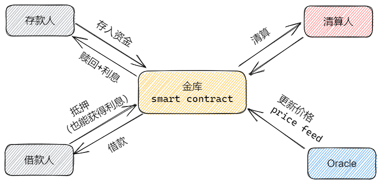
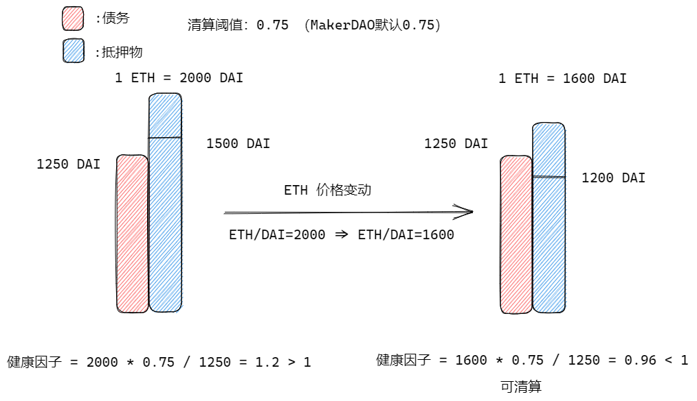
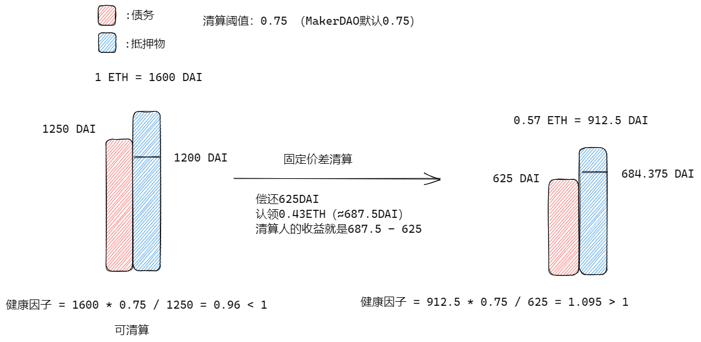
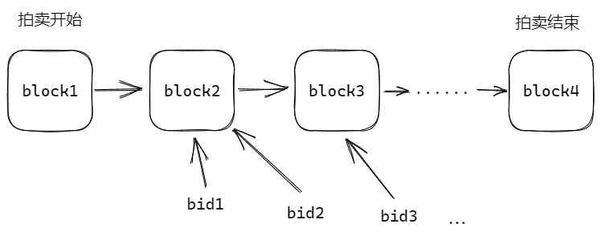
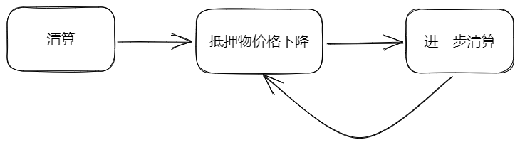

> 信贷 - 现代金融体系的神奇工具，也是形成经济周期的一大因素

## 传统借贷

一般的传统借贷分为信用借贷（社保记录、银行卡流水）、抵押借贷（房产、汽车）等等，包含的角色一般有借贷人，放贷人，清算人，而违约造成的清算和放贷则一般都由银行处理。但是流程极其缓慢，比如清算房产，法拍房流程低效且复杂。

## 链上借贷

稳定币，合成资产（aToken、cToken、yToken...）等都是基于此。

### 角色

四个角色分别与金库（智能合约）交互，形成了一套去中心化的借贷体系。而清算人的角色在传统借贷中一般都是银行，如果借款人的钱还不上，就会交给清算人处理。

### 案例 - MakerDAO

MakerDAO 是铸造 $DAI 的 母公司。

前置名词解释
1. 清算阈值：抵押物的价值 * 清算阈值 = 借贷能力（最多能借的钱）
2. 健康因子：抵押物的价值 * 清算阈值 / 债务 > 1 为健康，小于 1 可清算
3. 关闭因子：清算人一次能够清算抵押物的比例

假设清算阈值 = 0.75，关闭因子 = 0.5，1 ETH = 2000 DAI，我抵押 1 ETH最多能借出1500 DAI（但是借 1500 DAI risk拉满，ETH有一点下跌就会造成清算）。所以我借出 1250DAI。此时的健康因子为1.2 。当ETH价格跌到1600时，此时的清算阈值为 1200 DAI，健康因为为0.96 < 1 此时抵押物会被清算人清算。

### 清算

一般分为两类：固定价差清算和拍卖清算（又分为荷兰拍卖和英式拍卖）。清算是有收益的，有一个清算价差，MakerDAO 为 13%，一般清算都不会直接UI操作提供入口，都是清算智能合约机器人来操作。

#### 固定价差清算

清算人从合约中得到健康因子小于1的债务可以进行清算，从合约金库中获取抵押物并偿还部分对应的债务，使得借贷人的健康因子大于1，最多只能清算不大于关闭因子的抵押物比例。以往像 AAVE 都是即刻清算，现在会有一个缓冲时间来让借款人补仓，可能是12h / 24h

#### 拍卖清算

拍卖清算有一个漫长的链上过程，合约会定义一个拍卖时间段，根据不同的拍卖类型来进行拍卖，不停地接受清算人的报价，直到拍卖结束（英式拍卖）。

### 闪电贷

AAVE 支持闪电贷，不过要求较高，需要在一次 transaction 中完成，一般只能自己写合约，在一个 function里写完所有逻辑。

比如有去中心化交易所 Dex A 上 ETH/USDT = 1200，Dex B 上 ETH/USDT = 1150

我从 AAVE 借出5000 USDT，在B上买，A上卖出，最后归还，完成一次套利。

但是现实中，闪电贷却被很多黑客利用，比如有些支持合约的去中心化交易所的价格用的是 Uniswap 的价格预估接口，先开一个空单，然后借 ETH 去 Uniswap 砸盘，然后合约平仓获利走人，归还 ETH。这种闪电贷攻击行为非常恶劣。

### 循环贷

从借贷协议中借出的币同样可以在别的交易所买抵押物再次借贷，循环贷风险大，可能会造成去杠杆螺旋清算（因为清算会卖出抵押物，是一个砸盘行为）。

