这两个月过的飞快，工作上发生的事情恍如隔世。
今年开始就没有Code for fun了，而是Report for kpi……

## 工作
五一回来后，组内发生了一些比较大的人事变动，直接后果就是会议增多，文档工作飙升；此外每天早上早起了半小时只因9点一定要坐到工位上「25层的楼电梯只有三客一货」。
今年看得出来我的上级赋予我的角色是项目管理而不是编码「虽然我还是参与大部分的编码」。我深知我的技术水平还不够披荆斩棘，但是从公司的利益角度出发，管理好每个项目，支持项目顺利交付才是要事，而不是说要发展技术深度，毕竟能结项就够了。只能说从我个人发展路线来看，我是不满意的，我想法中过早开始接触项目管理，只会让我脱离技术，与公司业务强耦合。而与各个部门的接触、交流、斗争来看，我再继续下去只会让我变得更加老六，更加得想如何去迫害对方，人心不齐，怎么能做好一件事呢？而在派系斗争里如果选择打不过就加入的话，那我为什么不回家玩这种游戏呢。

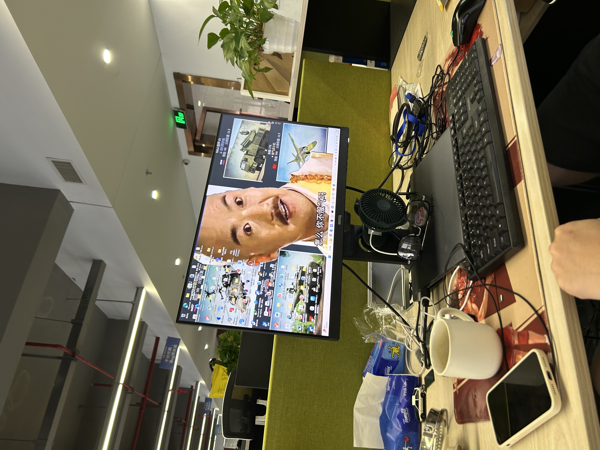

## 羽球
不得不说今年身体感觉恢复了一些，在某一天8-11的局上，结束了我还不是很累，这放去年我已经躺下了。也可能与现在大部分球馆有空调有关系「我是个出汗很少的人，很容器中暑」。还记得去年在朋友的学校里打球，没动一会就瘫着了，而且人很晕。今年长记性了，去哪儿打球都先干一瓶藿香正气水。

一天打了9个小时「9-12，14-18，20-22」

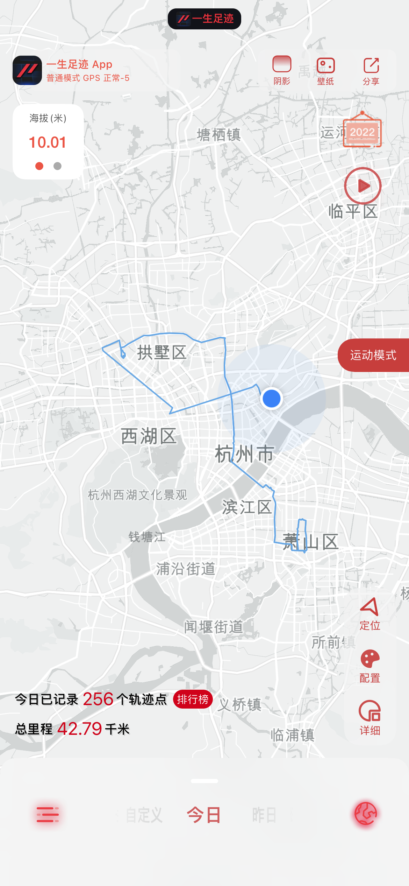

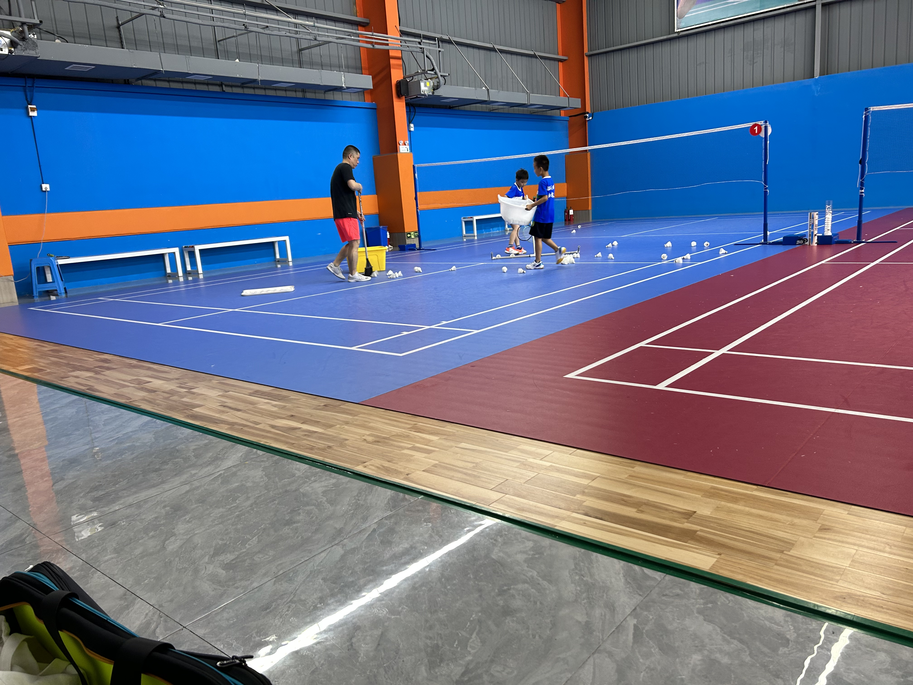

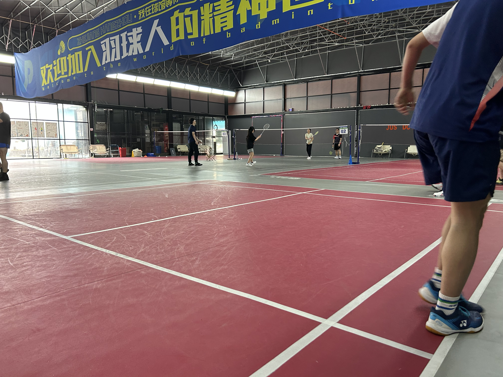

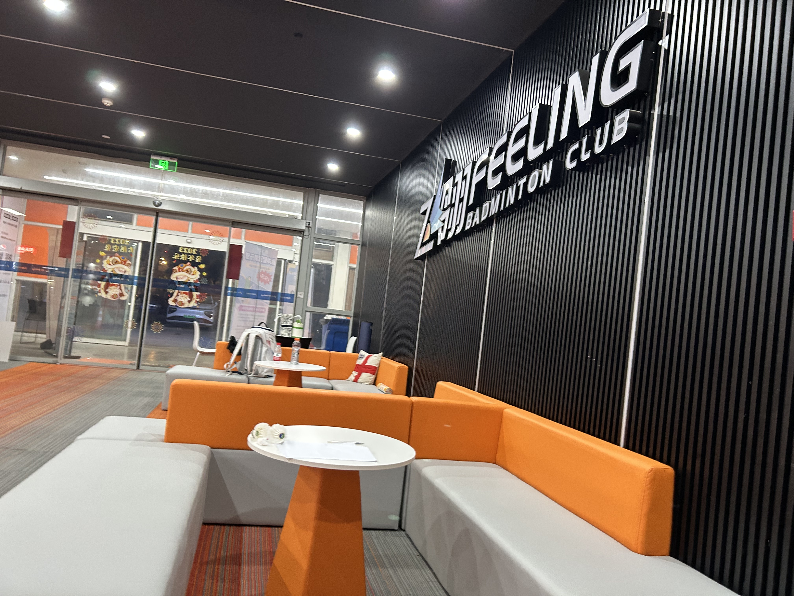

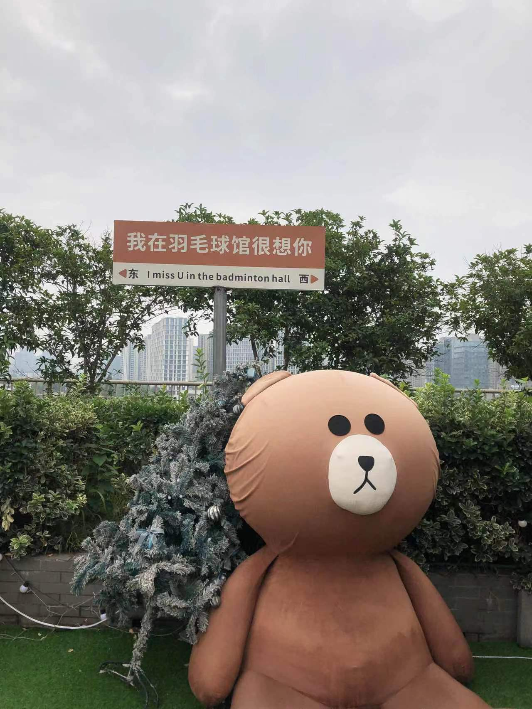

拉伸完人没了😭
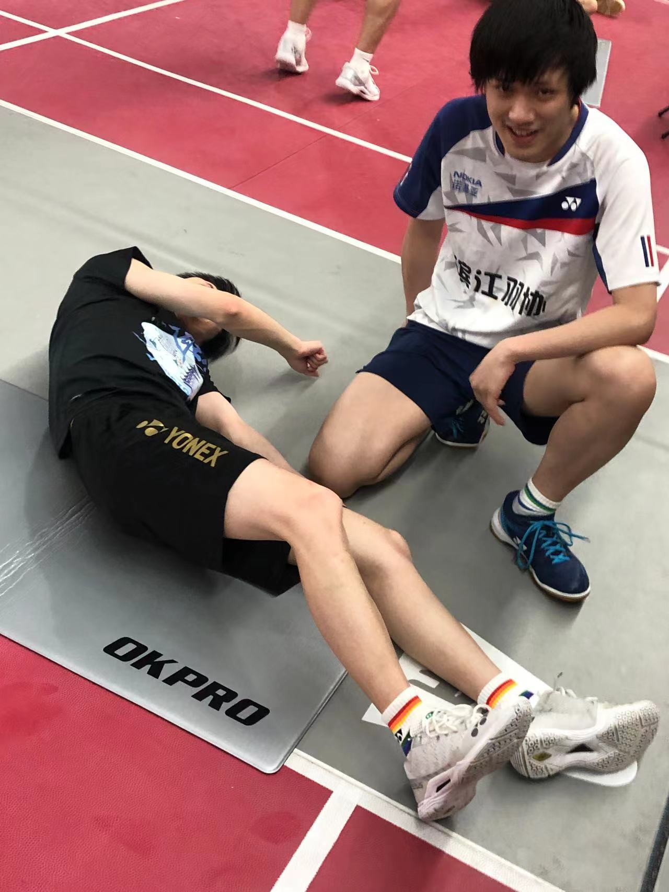

第一次健身

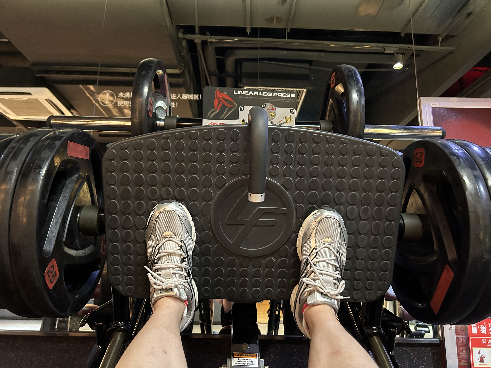

回家打球也太舒服了

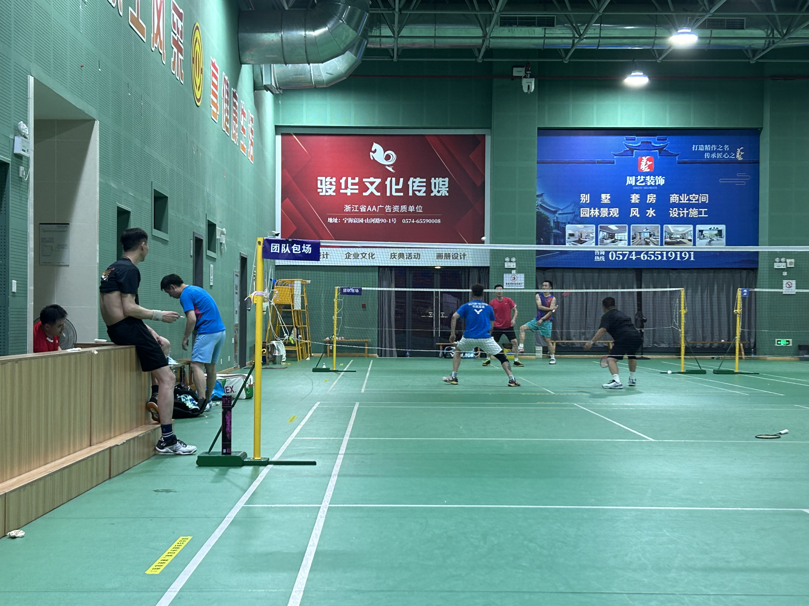

牛肉真好吃「肉食动物狂喜」
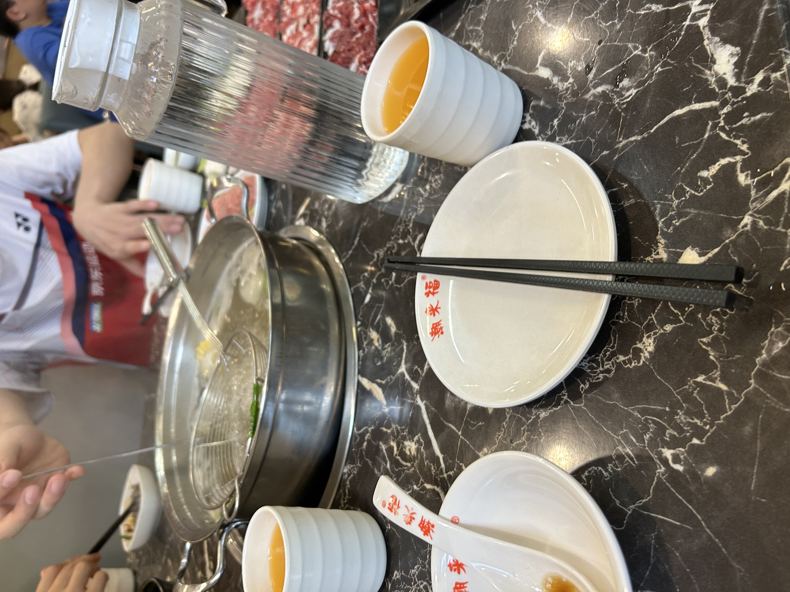

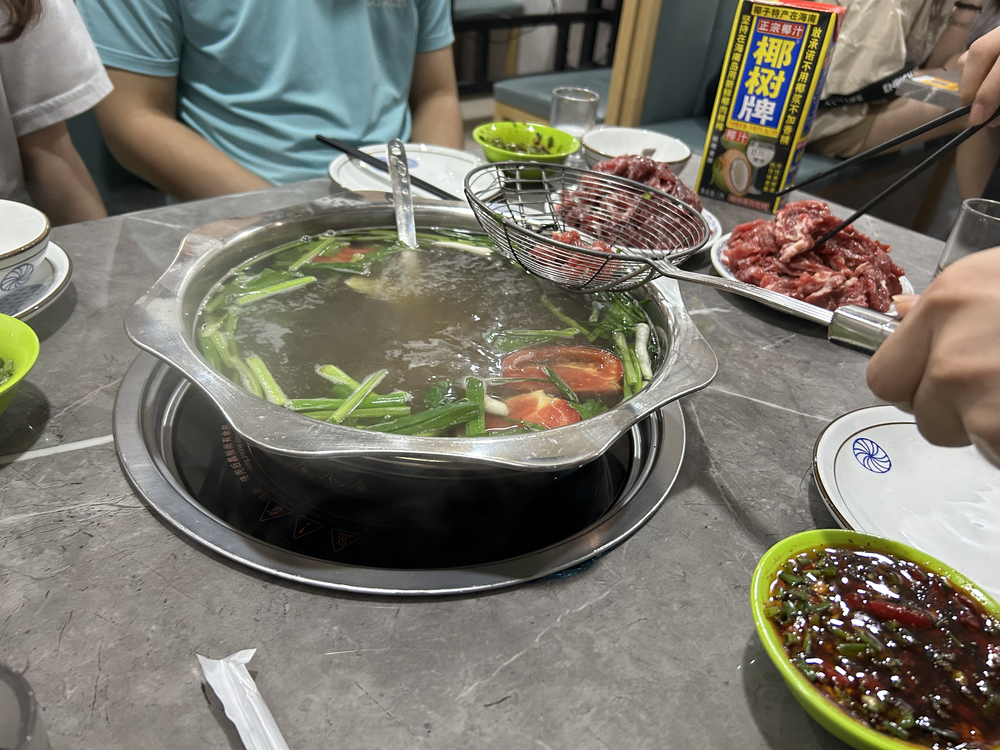

## 包粽子
以前几乎不会参与公司的各种活动「没时间也没兴趣」，这次我在同事的劝说下决定去参与包粽子。不过从来没包过粽子的我就是打着玩儿的心态去的，包出来的粽子千奇百怪，也算是一个收获吧。

煮好后慷慨的送给了我的师父吃「🐶」
