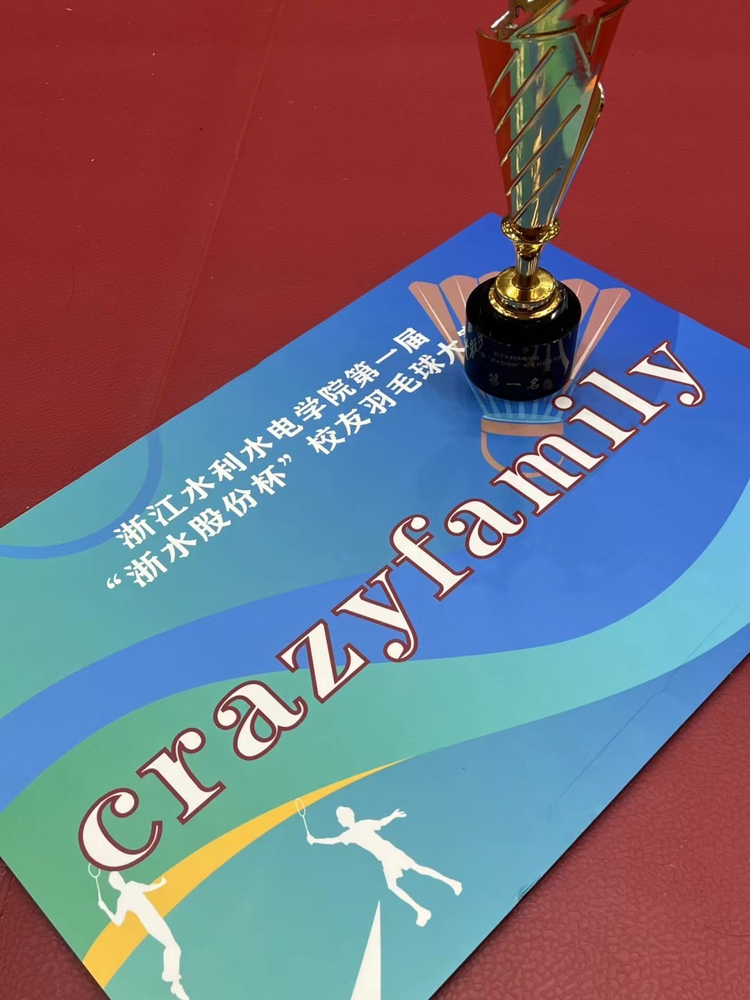

> gaming、badminton filled vacation
> 
国庆还是一如既往地躺在家里，陪伴家人和休息，游戏和打球。从我目前的状态来看，做这几件事情非常的舒服，也很解压。

换了一个金属保持器，现在只需要晚上睡觉的时候戴一下就可以了，白天可以解放牙齿了。

假期一直在玩[FTK](https://store.steampowered.com/app/527230/For_The_King/)，消磨时间的好游戏。

临走前买了一台Marshall Stanmore III放在家里，可以让父母听播客或者放音乐，出发前一小时拿到货，稍微把玩了一下。不过对我自己来讲似乎已经对这些东西暂时没有兴趣，声音么就听个响。

## 🏸️
算上请假我放了9天，回来要连上6天。第一天上班就出差，满打满算一天搞定。现在有些摆烂，以前我会把出差排的很紧，想尽快完成任务。我猜以前应该是好奇和激情所驱动吧……

第一个周末就安排了2天的早球，打早球有个好处就是不会睡懒觉，增加了一天的时间，早上打完中午洗澡吃饭下午晚上还有大把的时间来做想做的时候。以往我都是起床就快中午了，然后晚上打球，就是说只有下午的时间是自己的了。

第一周就断了两根线...然后买了一支新拍，小戴的白金利爪，很是好看。

第二周也算是两个早球，周六回学校参加了比赛，很幸运拿到了冠军，白嫖了一支拍子。

周日早上也是约了早球，打完后来到城北参加下午场。下午这场算社交球吧，没什么对抗，但也正好让我休息一下，和朋友们叙叙旧。

至此算是连续20天没睡过懒觉了，但是高强度的打球让身体有点吃不消。推拿师傅手一捏就说两侧腰怎么按起来不太一样😅

现在只剩下一块拍子没断线了，打算休息一段时间「天气冷了开始摆烂」，只在家里锻炼下核心好了。
