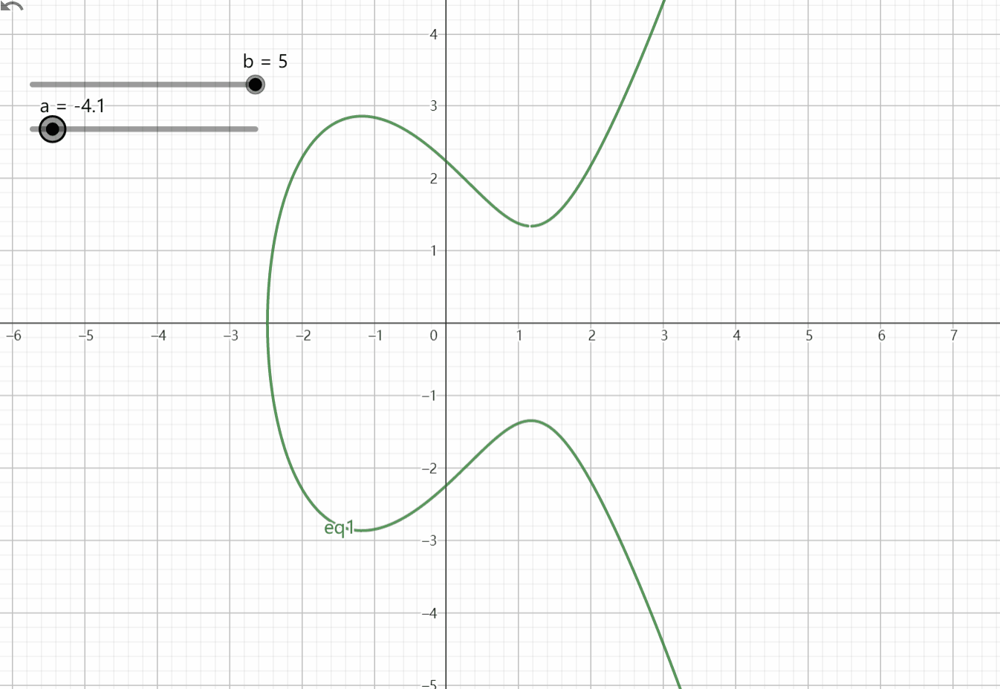

如何生成地址？什么是非对称加密？

## 生成地址的步骤

1. 随机生成一个 256 位的私钥（32字节）
2. 通过椭圆曲线加密获取公钥
3. 公钥经过两次 hash 函数 生成 20 字节的地址

## 椭圆曲线

$$
y^{2} =x^{3} +ax+b
$$

其中私钥 K, 公钥P。

在曲线上随机取一点A(x,y)，计算Kx+Ky等于P。即KA=P，其实P就是曲线上的一个坐标点。Bitcoin中有一个公认的点G扮演点A的角色，也就是说随机点是公开的，G相当于一个常数。

### 消息加密

NP问题：给定P和G很难求出K，但是根据K和G可以很快验证P是正确的

有两个人 Alice，Bob他们分别有自己的公钥私钥
+ Alice：Pa Ka
+ Bob：  Pb Kb

Pa = Ka * G

Pb = Kb * G

其中公钥是公开的。也就说两人还能知道另一个信息
+ Alice： Ka * Pb = Ka * Kb * G
+ Bob ： Kb * Pa = Kb * Ka * G

这两个信息是相等的，相当于这两个人的相同的key，这个key就可以相当于是只属于这两个人的对称密钥。

当Alice想给Bob写信，用Pb加密信息，Bob用Kb解密，即做一个可逆运算。

### 数字签名
m：message

Alice用Ka对m签名，m * Ka = N ，类似用私钥生成公钥（m为G）
对方想要验证这句话是Alice说的

m * Pa = m * G *  Ka ,即 = G * N，由于G是公开的，所以很快就能验证m是否是Alice说的

[参考视频](https://www.youtube.com/watch?v=0_XmvNu0J40&ab_channel=%E5%A6%88%E5%92%AA%E8%AF%B4MommyTalk)
