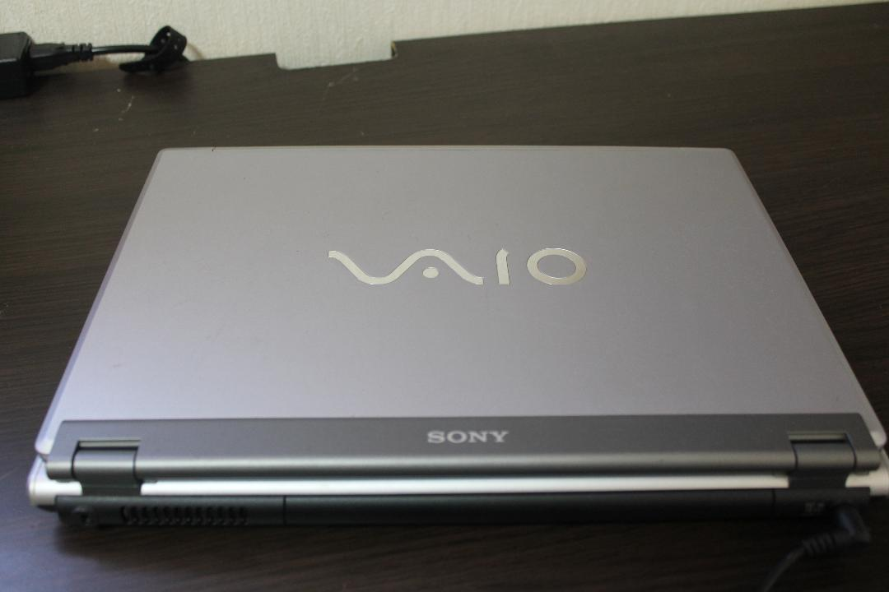

下礼拜就开学了，在经历了史上最长假期后想记录一下自己的一些想法

------------

## 思考

其实我大三开学就有了考研的打算，不过还只是一个简单的想法并没有去花太多时间去研究，那段时间也大部分在查漏补缺之前落下的课程。在搭了自己的博客之后也陆续的看到了很多的技术大牛，有的人甚至还在高中，就能写出自己的博客框架。这让我对技术的认知和家庭的影响有了很大的改变，也让我怀疑现在开始努力迟了么？是不是从小就落后一些好的家庭教育的同学呢？在B站还看到一个上幼儿园的小朋友拿着iPad在做swift语法教学，更让我想起了我那么小的时候在干嘛呢？

我小时候也算是蛮早接触电脑的吧，可能是小学一年级或者更早，家里买了一台大屁股显示器的电脑。也可能是家里几个哥哥的影响，电脑在我印象中就是拿来玩游戏的，我并不能像linus小时候一样在爷爷的带领下去“玩”计算机底层的东西。这在我家庭是不现实的，甚至大多数家庭应该都不现实。毕竟2000年初的中国也不是大部分家庭有linus这样的背景的，虽然我对父亲买电脑的原因、甚至工作的内容都很模糊，但是小时候我哪儿会想这些呢，对每天晚上能玩一会儿游戏就很开心。

接下来的记忆就有点模糊，只记得后来家里换了台配置好点的台式机和一台索尼VAIO的笔记本电脑（ 现在几乎看不到这个品牌 ）。那是我第一次见到笔电，就感觉挺神奇的。后来自己有了一台笔记本，我还清楚的记得是Lenovo的，win7系统。当时我误认为了是vista，因为在去别人家的时候看到过这种新潮的交互界面，比xp确实酷多了。这时候应该是初中，然后就开始了每天先拼了命把作业写完然后开始游戏时间。从小我就不太喜欢玩网游，一直玩的是破解版的那些单机游戏，那时候也没有版权的意识，就觉得很好玩。还记得每年快到生日的时候就是新的COD快发售的时候，那段时间会很兴奋。我从4一直玩到9。但是唯独也没有想过游戏是怎么做的。

高中之后还是那台Lenovo，玩的少了，大家都开始玩MOBA游戏，为了融入大家我会跟着他们玩，但是始终我不太喜欢玩MOBA游戏。其实高中是我过的最快乐的几年，遇到了最松的班主任，也认识了很多深交的同学。上了大学之后一度认为大学比高中还累。可能我上了一个不好的学校，但是我完全不后悔高中快乐了三年。

### 考研or工作

但是想到这里还是会对自己的学历感到一些自卑。说是说计算机讲究技术，不看重学历，但是在中国这个社会，要选拔出人才，怎么可能不看学历呢。就像字节跳动的面试，上来就是给你一大堆算法题，要我在这一轮就直接GG了。可能几年的工作经历确实比一个研究生学历来的重要。不过要是几年的工作经历并不是做一个完整的项目，而是每天CRUD，复制粘贴那种只需要三个键的经历。那跟荒废两年有什么不同。学校开设的中软班我当时非常想去，说白了其实就是个培训班，早点适应企业开发就是了，但是确实是个挺好的机会，但是我想着想着就错过了报名时间(￣_,￣ )所以也只能走考研这条路了，希望能在当前的大环境下走的顺利。

## 学习

讲道理将近4个月没玩游戏还是有点难受，不过也过来了。数学把基础部分看了一遍，题目也刷了一遍。但是总感觉效率不是很高，可能在家也有原因。

英语并没有背单词，背单词太痛苦了，还不如看文章把不认识的记下来好点。看完刘晓燕的长难句，稀里糊涂的记了一大堆笔记。突然有点想念高中英语老师。长难句属于几乎分离不出结构，看懂的话要看感觉。

政治没有开始。

专业课匆匆看了一遍，毕竟是去年上过的。不过数据结构我学的还是很烂，有待加强。

### 5月6月

完成基础部分的学习

数学三大块：极限、中值定理、定积分（体积有点弱）

（证明题很弱，构造函数想不出，方法想不出）

专业课脱离键盘

英语多看文章吧，真题可以做起来了

## 一点想法

其实我是很讨厌政治话题的，不过在当前环境下让我出乎意料的是：全世界有那么多国家针对中国。其实一开始我感觉几个外交发言人的言语过于激烈，后来仔细想了下也正是他们在保护中国，不然又要重蹈覆辙。我是认为只有共产党是适合中国国情的，墙也是应该存在的。以后还是少看点这些东西了，Twitter卸载

## 剧

没游戏玩剧还是能看，毕竟脚扭了躺床上还是要做点事情

1. 纸房子，教授还是一如既往的出乎意料
2. 李尸朝鲜，看解说还是自己看来的舒服，三胖可以搞点生死草77

希望接下来不是这种状态了...
